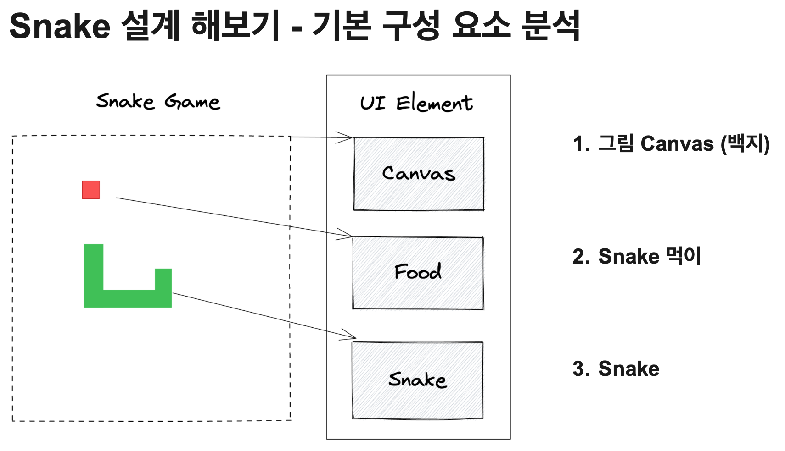
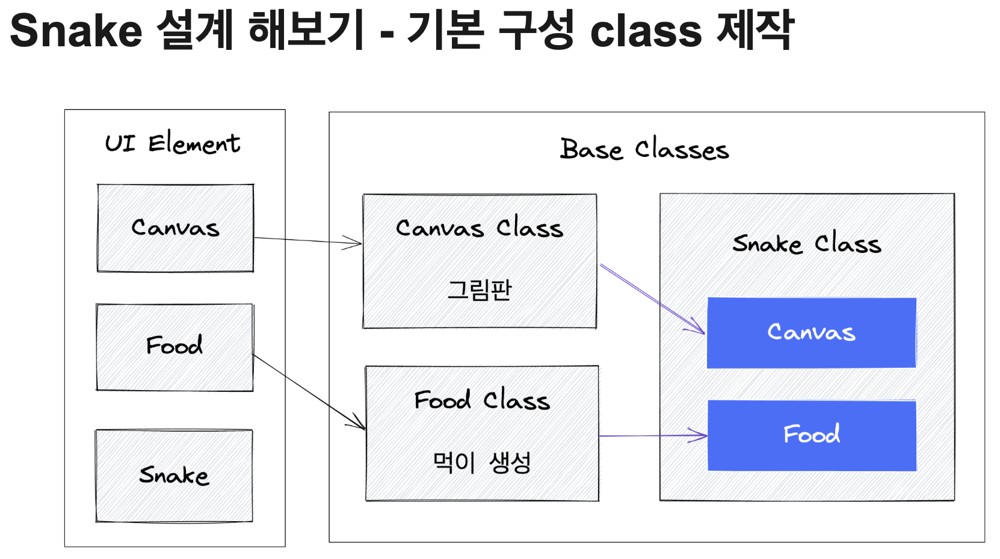
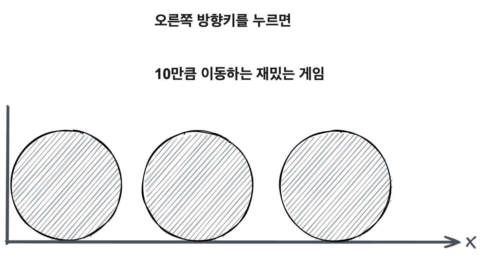
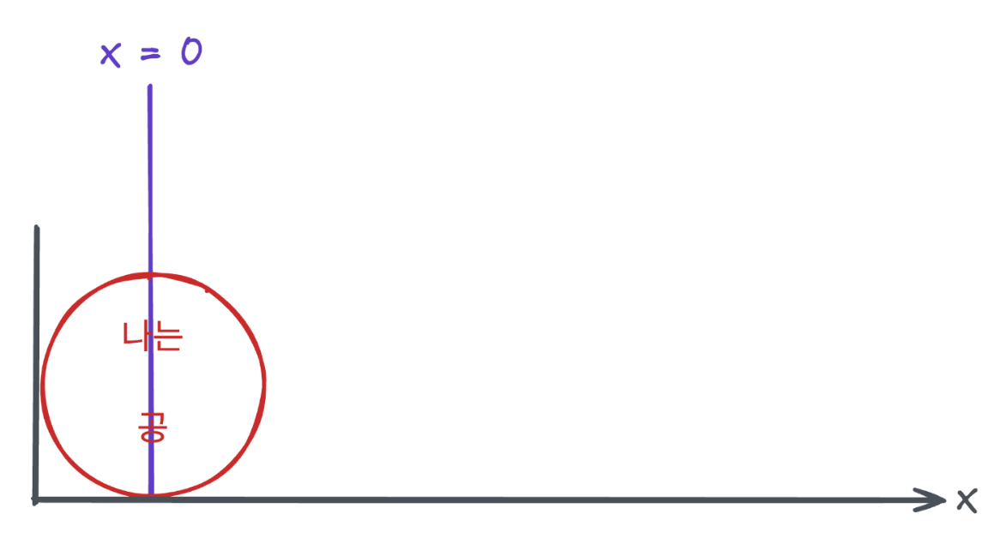
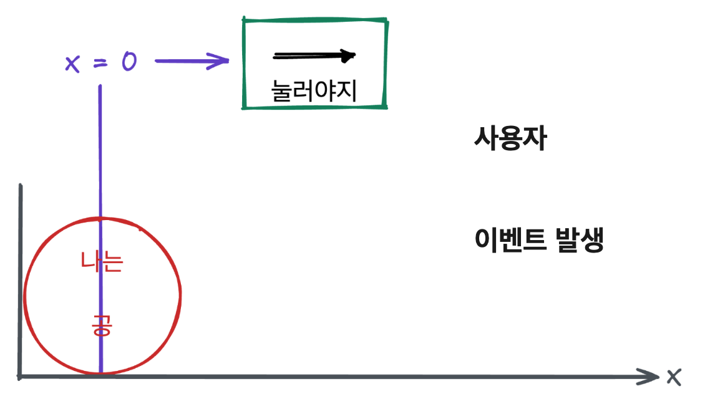
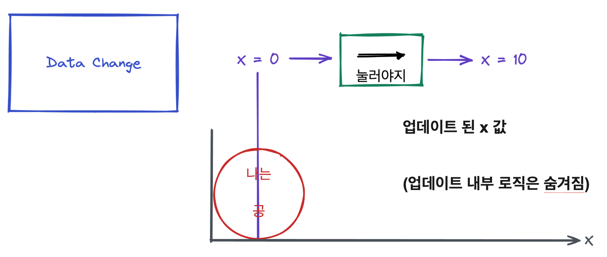
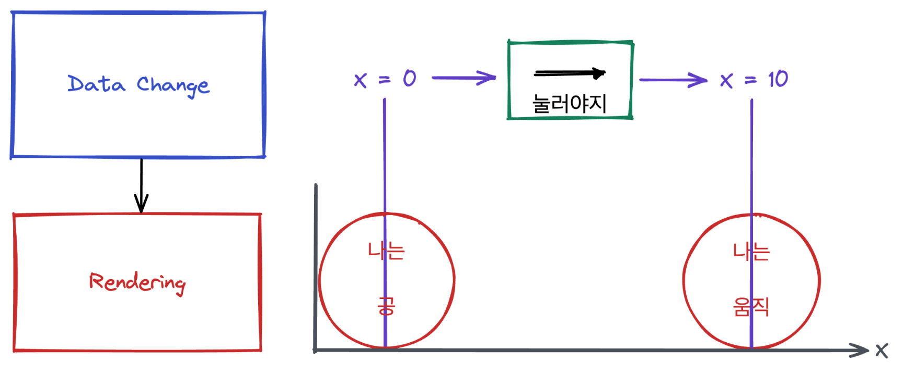
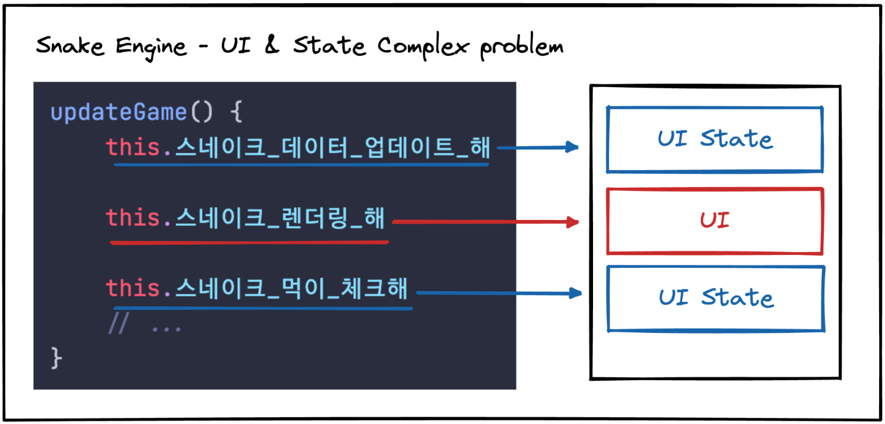
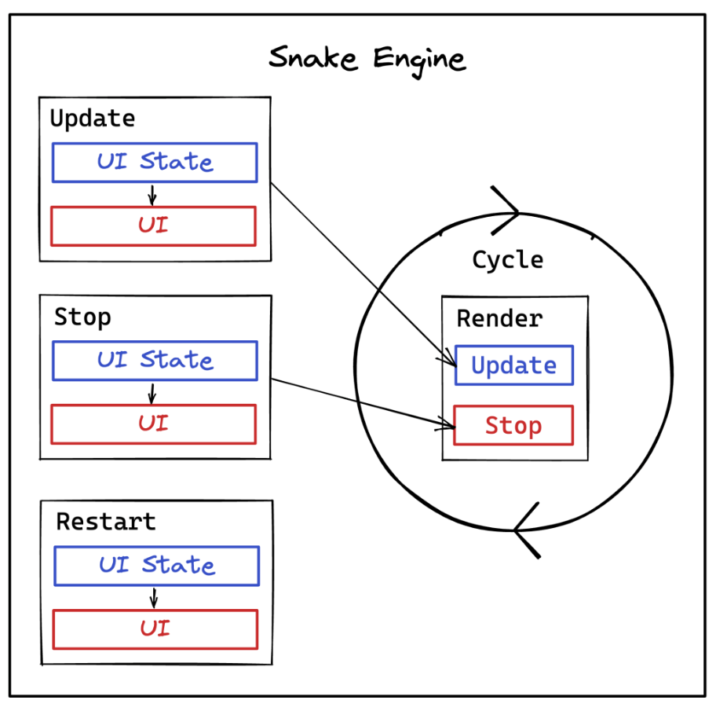
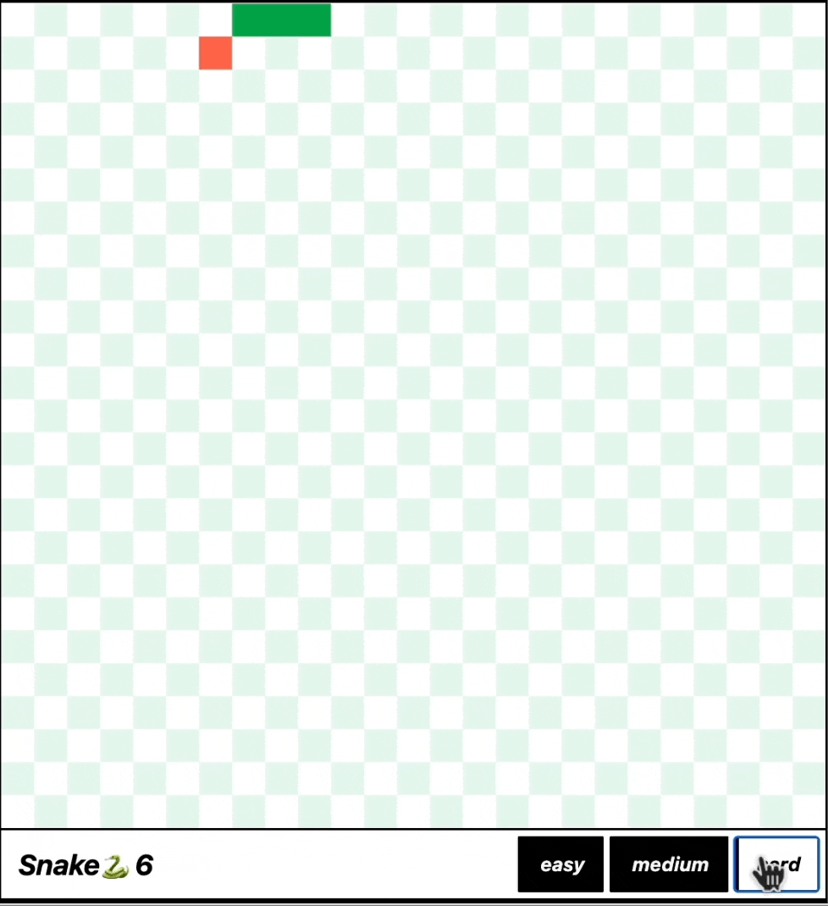

# Snake Game / 7일

## 중점적인 고민 사항 🧐

> 유지 보수에 좋은 프로젝트 설계

1. game과 관련된 최소 단위의 구성요소를 class로 분리
2. 각 class의 역할은 최소 기능 단위로 확정

## Snake Game 🐍의 절차 분석하기

본격적인 game 개발에 앞서, 진행 과정을 살펴보고 각 요소를 분리해봅니다.



snake의 구성요소

1. Drawing canvas
2. Snake Food
3. Snake Body

로 총 3가지로 게임의 요소를 분리해서 생각할 수 있습니다.

## 기본 구성 class 설계하기

앞서 살펴보았던 3가지 요소는 snake game의 UI element로 생각할 수 있습니다.

지금부터는 각 UI element로부터 실제 기본 구성 class를 설계해봅시다.



1. `canvas`: snake game의 rendering engine이며, canvas class로 추상화 할 수 있습니다.
2. `food`: snake game의 item이며, food class로 추상화 할 수 있습니다.
3. `snake body`: snake game의 body이며, snake class로 추상화 할 수 있습니다.
4. `snake game engine`: canvas + food + snake body를 조합하여 snake game을 구현할 수 있습니다.
5. `game board`: snake game의 board이며, canvas class를 DI받아 구현할 수 있습니다.

## Data와 Rendering 분리하기

Snake game의 core 로직이 담긴 `snake engine class`를 개발하면서 고민이 생겼습니다. 점차 class의 메서드가 비대해지면서 **data와 rendering이 복잡하게 얽히는 현상**이 발생한 것입니다.

과현 Data와 Rendering 두가지의 coupling 문제는 어떻게 해결할 수 있을까요?

우선 게임 개발에서 data와 rendering이 어떠한 연결지점이 있는지 살펴보겠습니다.

### Data와 Rendering의 연결지점

오른쪽 방향키를 누르면 `10px`이동하는 재미있는 게임을 생각해봅시다.



위 게임을 data와 rendering의 절차 구성으로 분리해봅시다.



x-좌표계 위에 공이 놓여있는 곳의 임의의 위치를 x로, x위치에 공의 반지름 r만큼 원이 그려져있습니다.
여기서 어떤 유저가 오른쪽 방향키를 **한번** 눌렀다고 생각합시다. 즉 data를 변화시키는 이벤트가 발생한 것입니다.



이벤트 발생 즉시 저희가 만든 게임은 즉시 x를 10으로 변경시킵니다. 즉 내부 로직은 알 수 없지만, **data가 event에 의해 변화된 것**입니다.



이제 변화된 data(x=10)에 대한 새로운 공을 그려야 합니다.



즉 어떤 event에 의해 data가 변화되면, rendering이 진행되는 것입니다.
이를 통해 data의 변화가 rendering에 영향을 주는 **단방향**의 관계임을 알 수 있습니다.

### Data와 Rendering 관심사의 분리

이제 우리는 게임에서 data와 rendering이 어떻게 연결되어있는지 알게 되었습니다. 이제 이 둘을 분리해봅시다.



기존의 `updateGame` 메서드를 간략하게 설명한 것입니다. 보다시피 UI state와 UI update로직이 한 메서드에 얽혀있는 것을 확인할 수 있습니다.

> 여기서 눈여결 볼 점은 State ❯ Update 순, 단방향으로 진행된다는 것입니다.

이제 로직의 구성을 알았으니 각각의 역할에 맞게 관심사를 분리해봅시다:)

### 기능의 분리



이제 engine의 각 메서드는 UI state와 UI update의 구성으로 모두 분리되었습니다. 이런 구조에는 다음과 같은 장점들이 있습니다.

1. data와 rendering의 관심사가 분리되어, 각각의 역할에 집중할 수 있습니다.
2. ui의 변경에 유연하게 대응가능합니다.
3. 핵심 data 로직의 변경 또한 data modifier method만 수정하면 되며, 훨씬 빠르게 주요 로직을 찾을 수 있습니다.

## Demo한번 구경하실까용?

UI를 개발할 때는 저번 vanilla-todo에서 제작한 reactive component를 활용해서 snake game을 만들어봤습니다!

```bash
pnpm vite:build

pnpm vite:preview
```

를 통해 빌드 및 미리보기를 해보실 수 있습니다. 감사합니다!😀


